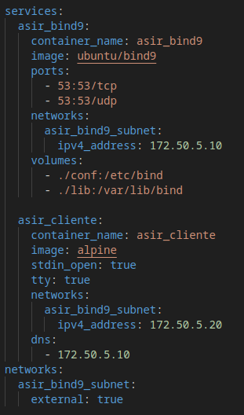
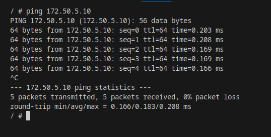
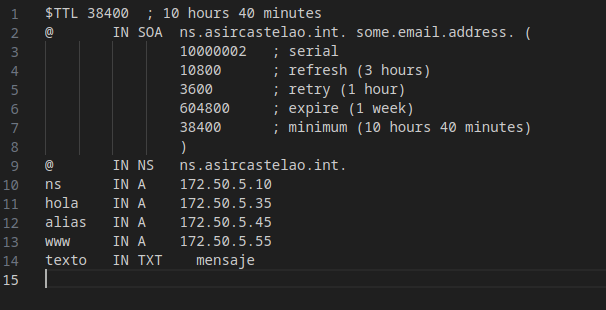
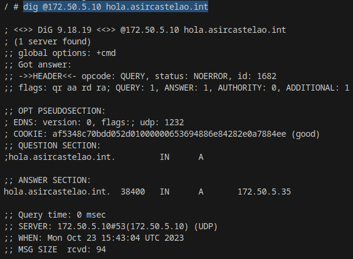
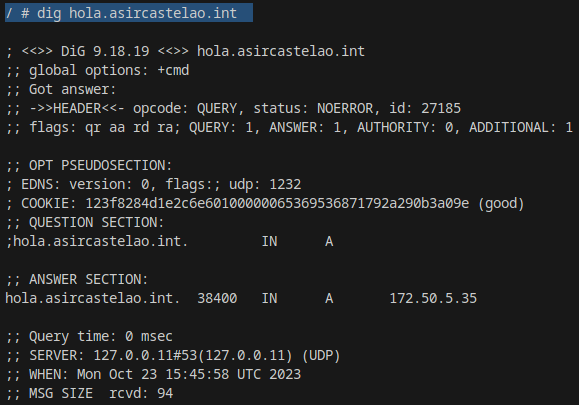

# Cliente DNS

**En la siguiente imagen se muestra cómo está configurado el Servidor DNS y cómo está configurado el cliente utilizando una imagen Alpine.**

**Además muestra cómo el cliente tiene como DNS a dicho servidor**

**Por defecto Alpine tiene el comando Ping. Para instalar el dig se utiliza el siguiente comando:**

    apk add --update bind-tools

**En el documento "asircastelao.int" podemos ver una tabla con una lista de direcciones**

**Ahora con el comando dig podemos comprobar si cliente resuelve con el dns configurado**

**hola**